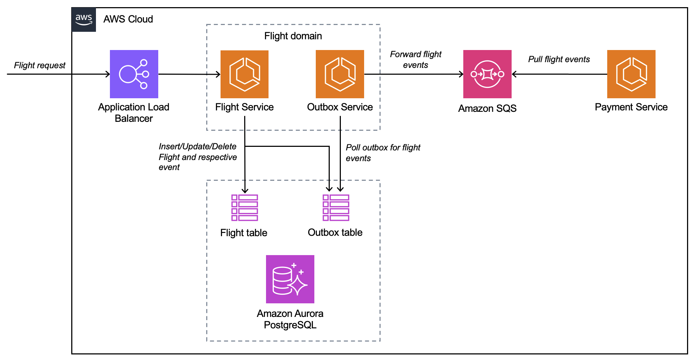

## Transactional Outbox Pattern Sample

## Intent

The transactional outbox pattern resolves the dual write operations issue that occurs in distributed systems when a single operation involves both a database write operation and a message or event notification. A dual write operation occurs when an application writes to two different systems; for example, when a microservice needs to persist data in the database and send a message to notify other systems. A failure in one of these operations might result in inconsistent data.

## Motivation

When a microservice sends an event notification after a database update, these two operations should run atomically to ensure data consistency and reliability.
- If the database update is successful but the event notification fails, the downstream service will not be aware of the change, and the system can enter an inconsistent state.
- If the database update fails but the event notification is sent, data could get corrupted, which might affect the reliability of the system.

## Applicability

Use the transactional outbox pattern when:
- You're building an event-driven application where a database update initiates an event notification .
- You want to ensure atomicity in operations that involve two services.
- You want to implement the event sourcing pattern.

## Issues and Considerations

Issues and considerations
- Duplicate messages: The events processing service might send out duplicate messages or events, so we recommend that you make the consuming service idempotent by tracking the processed messages.
- Order of notification: Send messages or events in the same order in which the service updates the database. This is critical for the event sourcing pattern where you can use an event store for point-in-time recovery of the data store. If the order is incorrect, it might compromise the quality of the data. Eventual consistency and database rollback can compound the issue if the order of notifications isn't preserved.
- Transaction rollback: Do not send out an event notification if the transaction is rolled back.
- Service-level transaction handling: If the transaction spans services that require data store updates, use the saga orchestration pattern to preserve data integrity across the data stores.

## Implementation

This sample will lead you to provision the following infrastructure:


### Prerequisites

-	An AWS account
-	An AWS user with AdministratorAccess (see the instructions on the AWS Identity and Access Management (IAM) console)
-	Access to the following AWS services: Elastic Load Balancing, Amazon ECS, Amazon Aurora, Amazon SQS
-	Docker, Java 17 and NodeJS installed

### Deploy using CDK

#### Step 1: Download the application

```shell
$ git clone https://github.com/aws-samples/outbox-pattern-netcore-blog.git
```
#### Step 2: Deploy the CDK code

The `cdk.json` file tells the CDK Toolkit how to execute your app. Make sure the region in `infra/lib/infra-stack.ts` (line 92) matches the region in which you plan to deploy your stack. Build and deploy the CDK code (including the application) using the commands below.

```shell
$ npm install -g aws-cdk
$ cd infra
$ cdk bootstrap
$ cdk synth
$ cdk deploy
```
After about 5-10 mins, the deployment will complete and it will output the Application Load Balancer URL. You can append `swagger-ui.html` to the ALB URL to access the Swagger page.

## Security

See [CONTRIBUTING](CONTRIBUTING.md#security-issue-notifications) for more information.

## License

This library is licensed under the MIT-0 License. See the LICENSE file.