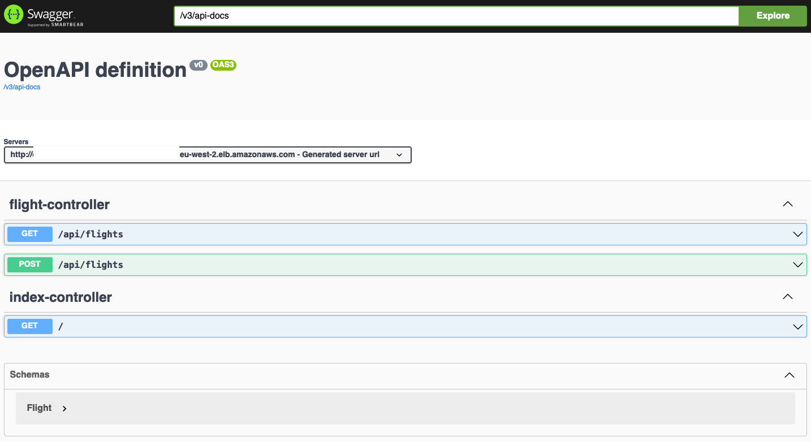
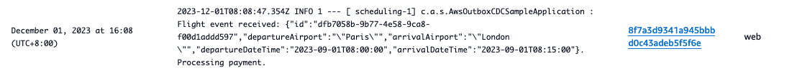
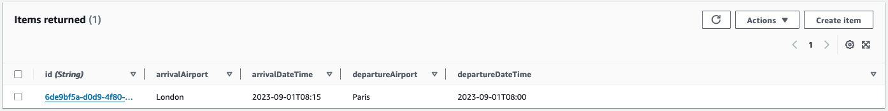

## Transactional Outbox Pattern Sample

## Intent

The transactional outbox pattern resolves the dual write operations issue that occurs in distributed systems when a single operation involves both a database write operation and a message or event notification. A dual write operation occurs when an application writes to two different systems; for example, when a microservice needs to persist data in the database and send a message to notify other systems. A failure in one of these operations might result in inconsistent data.

Blog reference: https://docs.aws.amazon.com/prescriptive-guidance/latest/cloud-design-patterns/transactional-outbox.html 

## Motivation

When a microservice sends an event notification after a database update, these two operations should run atomically to ensure data consistency and reliability.
- If the database update is successful but the event notification fails, the downstream service will not be aware of the change, and the system can enter an inconsistent state.
- If the database update fails but the event notification is sent, data could get corrupted, which might affect the reliability of the system.

## Applicability

Use the transactional outbox pattern when:
- You're building an event-driven application where a database update initiates an event notification .
- You want to ensure atomicity in operations that involve two services.
- You want to implement the event sourcing pattern.

## Issues and Considerations

Issues and considerations
- Duplicate messages: The events processing service might send out duplicate messages or events, so we recommend that you make the consuming service idempotent by tracking the processed messages.
- Order of notification: Send messages or events in the same order in which the service updates the database. This is critical for the event sourcing pattern where you can use an event store for point-in-time recovery of the data store. If the order is incorrect, it might compromise the quality of the data. Eventual consistency and database rollback can compound the issue if the order of notifications isn't preserved.
- Transaction rollback: Do not send out an event notification if the transaction is rolled back.
- Service-level transaction handling: If the transaction spans services that require data store updates, use the saga orchestration pattern to preserve data integrity across the data stores.

## Implementation

We will look at two ways of implementing this pattern: one leveraging a traditional relational database and an outbox table, and one leveraging a NoSQL database that natively supports real-time change data capture.

This sample will lead you to first provision the following infrastructure, leveraging [Amazon Elastic Load Balancer](https://aws.amazon.com/elasticloadbalancing/), [Amazon ECS](https://aws.amazon.com/ecs/), [Amazon Aurora](https://aws.amazon.com/rds/aurora/) and [Amazon SQS](https://aws.amazon.com/sqs/):


You will then be provisioning the following infrastructure, leveraging [Amazon DynamoDB](https://aws.amazon.com/dynamodb/) and [Amazon Kinesis Data Streams](https://aws.amazon.com/kinesis/data-streams/)


### Prerequisites

- An [AWS](https://aws.amazon.com/) account.
- An AWS user with AdministratorAccess (see the [instructions](https://console.aws.amazon.com/iam/home#/roles%24new?step=review&commonUseCase=EC2%2BEC2&selectedUseCase=EC2&policies=arn:aws:iam::aws:policy%2FAdministratorAccess) on the [AWS Identity and Access Management](http://aws.amazon.com/iam) (IAM) console).
- Access to the following AWS services: Elastic Load Balancing, Amazon ECS, Amazon Aurora, Amazon SQS, Amazon DynamoDB and Amazon Kinesis Data Streams.
- [Docker](https://docs.docker.com/engine/install/), [Java 17](https://www.oracle.com/java/technologies/javase/jdk17-archive-downloads.html) and [NodeJS](https://nodejs.org/en) installed. Docker client running.

### Deploy using CDK

#### Step 1: Download the application

```shell
git clone https://github.com/aws-samples/transactional-outbox-pattern.git
```

#### Step 2: Initialize your CDK environment and deploy basic resources

The `cdk.json` file tells the CDK Toolkit how to execute your app. Build and deploy the CDK code (including the application) using the commands below. Replace <MY_PUBLIC_IP> by the public IP you will use to access the ALB endpoints (you can find your public IP through websites such as https://www.whatismyip.com/).

```shell
npm install -g aws-cdk
cd transactional-outbox-pattern/infra
npm install
cdk bootstrap
cdk synth
cdk deploy BaseStack --parameters myPublicIP=<MY_PUBLIC_IP>/32
```
After about 5-10 mins, the deployment will complete.

### Usage (First Implementation)

#### Deploy the CDK code

```shell
cdk deploy AuroraStack
```
After about 5-10 mins, the deployment will complete and the Application Load Balancer URL will be printed. 


#### Happy Path

1. Append `swagger-ui/index.html` to the ALB URL to access the Swagger page in your browser:


2. Let's book a first flight ticket from Paris to London (you can replace the departure, destination and dates/times as you desire):
```json
{
    "departureAirport": "Paris",
    "arrivalAirport": "London",
    "departureDateTime": "2023-09-01T08:00:00.000Z",
    "arrivalDateTime": "2023-09-01T08:15:00.000Z"
}
```


After a few seconds, the flight event is processed by the Payment service.

3. To view the logs, navigate to the `Elastic Container Service` page of the AWS Console. - Click on `Clusters` in the left pane and then click on the Cluster you just deployed.

4. In the `Services` tab, click on the service you just created and then navigate to the `Logs` tab. If you have trouble finding the relevant log line, you can use the search box to filter for `Processing payment`.


5. The flight has been recorded in the database:


6. And because the flight booking has been processed successfully, the Outbox table is empty:


This was the happy path - everything went according to plan. Now let's look at what happens when something fails - in that case we will simulate an SQS failure and observe what happens.

#### SQS Failure

1. For the sake of this example, we will remove the permissions for ECS to write to SQS:
    - Navigate to the `IAM` page in the AWS Console, the click on `Roles` in the left pane. Search for the role that was created during deployment (it should look something like `xxx-sqsFullRolexxx`) and click on it.
    - Click on the Policy and then the `Edit` button.
    - Change the effect from `Allow` to `Deny` and then click on `Next`.
    - Click on `Save Changes`

2. Navigate back to the Swagger page, and book a second flight ticket (you can replace the departure, destination and dates/times as you desire):
```json
{
    "departureAirport": "Paris",
    "arrivalAirport": "London",
    "departureDateTime": "2023-09-02T08:00:00.000Z",
    "arrivalDateTime": "2023-09-02T08:15:00.000Z"
}
```

**Request**


**Response**


3. The booking service will record an error because the queue is unavailable.


4. The event will remain in the outbox because the system has been unable to fully process the flight booking.


5. Subsequent to that, several strategies can be adopted depending on the requirements of the system (raise an alert, wait for the queue to become available again, retry with backoff, etc.).

#### Viewing Flight and Outbox tables

1. To view the content of both the Flight and the Outbox tables, navigate to the `RDS` page of the AWS Console.
2. Click on `Databases` in the left pane and then click on the cluster you just created.
3. Click on the `Action` button in the top-right corner and then on the `Query` action.

Note: The first time you do so, the Console will ask you for the credentials:
* Choose the relevant cluster in the drop down box
* Insert the database username you have defined in the CDK file (if you have not changed it, the default is `dbaadmin`)
* Insert the database password that has been generated when deploying the infrastructure. To get the password, you can navigate to the `Secrets Manager` page of the AWS Console, click on the relevant secret and then click on the `Retrieve secret value` button.
* Insert the database name that you have defined in the CDK file (if you have not changed it, the default is `outboxPattern`)

Example:


### Usage (second implementation)

#### Deploy the CDK code

```shell
cdk deploy CdcStack
```
After about 5-10 mins, the deployment will complete and the Application Load Balancer URL will be printed. 


#### Happy Path

1. Append `swagger-ui/index.html` to the ALB URL to access the Swagger page in your browser:



2. Let's book a first flight ticket from Paris to London (you can replace the departure, destination and dates/times as you desire):
```json
{
    "departureAirport": "Paris",
    "arrivalAirport": "London",
    "departureDateTime": "2023-09-01T08:00:00.000Z",
    "arrivalDateTime": "2023-09-01T08:15:00.000Z"
}
```


After a few seconds, the flight event is processed by the Payment service.

3. To view the logs, navigate to the `Elastic Container Service` page of the AWS Console. - Click on `Clusters` in the left pane and then click on the Cluster you just deployed.

4. In the `Services` tab, click on the service you just created and then navigate to the `Logs` tab. If you have trouble finding the relevant log line, you can use the search box to filter for `Processing payment`.



5. To view the flight item in the DynamoDB Table, navigate to the `DynamoDB` page, click on `Tables` in the left pane and then click on the `flight` table in the center of your screen. Then, click on the `Explore table items` button.

 

6. Because the message is kept in the Kinesis `stream` for 1 day (default value), the `Queue` service is resilient to transient SQS errors by design.

## Security

See [CONTRIBUTING](CONTRIBUTING.md#security-issue-notifications) for more information.

## License

This library is licensed under the MIT-0 License. See the LICENSE file.
