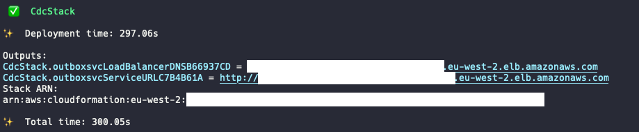
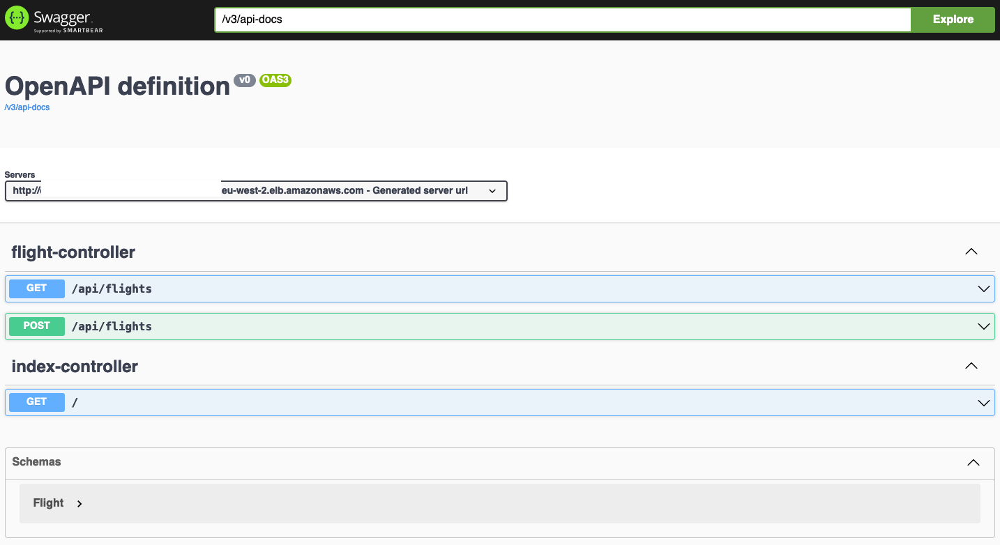
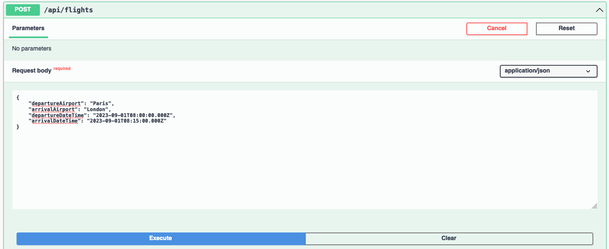
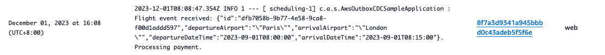
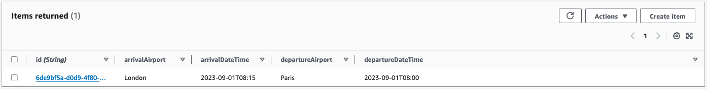

# CDC Implementation

## Deploy the CDK code

```shell
cdk deploy CdcStack
```
After about 5-10 mins, the deployment will complete and the Application Load Balancer URL will be printed. 


## Happy Path

1. Append `swagger-ui/index.html` to the ALB URL to access the Swagger page in your browser:



2. Let's book a first flight ticket from Paris to London (you can replace the departure, destination and dates/times as you desire):
```json
{
    "departureAirport": "Paris",
    "arrivalAirport": "London",
    "departureDateTime": "2023-09-01T08:00:00.000Z",
    "arrivalDateTime": "2023-09-01T08:15:00.000Z"
}
```


After a few seconds, the flight event is processed by the Payment service.

3. To view the logs, navigate to the `Elastic Container Service` page of the AWS Console. - Click on `Clusters` in the left pane and then click on the Cluster you just deployed.

4. In the `Services` tab, click on the service you just created and then navigate to the `Logs` tab. If you have trouble finding the relevant log line, you can use the search box to filter for `Processing payment`.



5. To view the flight item in the DynamoDB Table, navigate to the `DynamoDB` page, click on `Tables` in the left pane and then click on the `flight` table in the center of your screen. Then, click on the `Explore table items` button.

 

6. Because the message is kept in the Kinesis `stream` for 1 day (default value), the `Queue` service is resilient to transient SQS errors by design.

## Cleaning Up

Run the following command to destroy the resources:

```shell
cdk destroy CdcStack
```

As the DynamoDB table is `detroy protected` to ensure you do not lose any data, you will have to manually delete the resource in the Console. You can do so by navigating to the DynamoDB page of the AWS Console, clicking on Tables in the left pane, selecting your table in the list and then clicking on Delete.

