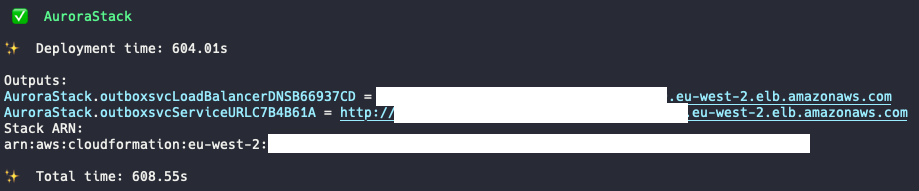
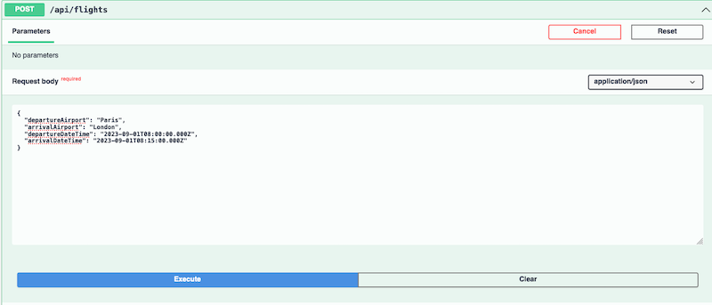
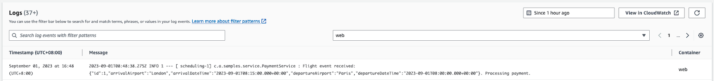
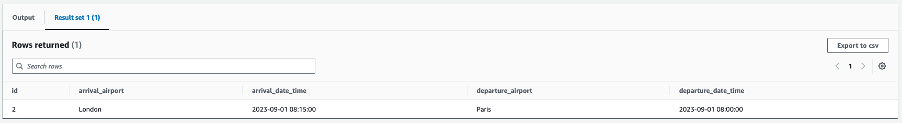
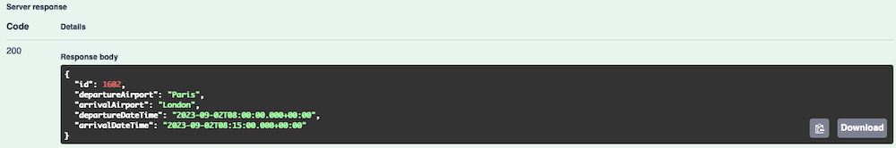
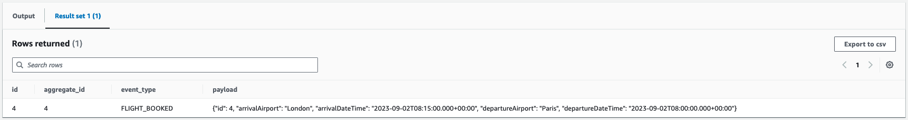

# Outbox Implementation

## Deploy the CDK code

```shell
cdk deploy AuroraStack
```
After about 5-10 mins, the deployment will complete and the Application Load Balancer URL will be printed. 


## Happy Path

1. Append `swagger-ui/index.html` to the ALB URL to access the Swagger page in your browser:


2. Let's book a first flight ticket from Paris to London (you can replace the departure, destination and dates/times as you desire):
```json
{
    "departureAirport": "Paris",
    "arrivalAirport": "London",
    "departureDateTime": "2023-09-01T08:00:00.000Z",
    "arrivalDateTime": "2023-09-01T08:15:00.000Z"
}
```


After a few seconds, the flight event is processed by the Payment service.

3. To view the logs, navigate to the `Elastic Container Service` page of the AWS Console. - Click on `Clusters` in the left pane and then click on the Cluster you just deployed.

4. In the `Services` tab, click on the service you just created and then navigate to the `Logs` tab. If you have trouble finding the relevant log line, you can use the search box to filter for `Processing payment`.



5. The flight has been recorded in the database (refer to [this](#viewing-tables) for the steps required to view tables):



6. And because the flight booking has been processed successfully, the Outbox table is empty:


This was the happy path - everything went according to plan. Now let's look at what happens when something fails - in that case we will simulate an SQS failure and observe what happens.

## SQS Failure

1. For the sake of this example, we will remove the permissions for ECS to write to SQS:
    - Navigate to the `IAM` page in the AWS Console, the click on `Roles` in the left pane. Search for the role that was created during deployment (it should look something like `xxx-sqsFullRolexxx`) and click on it.
    - Click on the Policy and then the `Edit` button.
    - Change the effect from `Allow` to `Deny` and then click on `Next`.
    - Click on `Save Changes`

2. Navigate back to the Swagger page, and book a second flight ticket (you can replace the departure, destination and dates/times as you desire):
```json
{
    "departureAirport": "Paris",
    "arrivalAirport": "London",
    "departureDateTime": "2023-09-02T08:00:00.000Z",
    "arrivalDateTime": "2023-09-02T08:15:00.000Z"
}
```

**Request**


**Response**


3. The booking service will record an error because the queue is unavailable.


4. The event will remain in the outbox because the system has been unable to fully process the flight booking.



5. Subsequent to that, several strategies can be adopted depending on the requirements of the system (raise an alert, wait for the queue to become available again, retry with backoff, etc.).

## Cleaning up

Run the following command to destroy the resources:

```shell
cdk destroy AuroraStack
```

As the database is `detroy protected` to ensure you do not lose any data, you will have to manually delete the resource in the Console. You can do so by navigating to the RDS page of the AWS Console, clicking on your Aurora cluster and then Actions > Delete.

## Viewing tables

1. To view the content of both the Flight and the Outbox tables, navigate to the `RDS` page of the AWS Console.
2. Click on `Databases` in the left pane and then click on the cluster you just created.
3. Click on the `Action` button in the top-right corner and then on the `Query` action.

Note: The first time you do so, the Console will ask you for the credentials:
* Choose the relevant cluster in the drop down box
* Insert the database username you have defined in the CDK file (if you have not changed it, the default is `dbaadmin`)
* Insert the database password that has been generated when deploying the infrastructure. To get the password, you can navigate to the `Secrets Manager` page of the AWS Console, click on the relevant secret and then click on the `Retrieve secret value` button.
* Insert the database name that you have defined in the CDK file (if you have not changed it, the default is `outboxPattern`)

Example:


